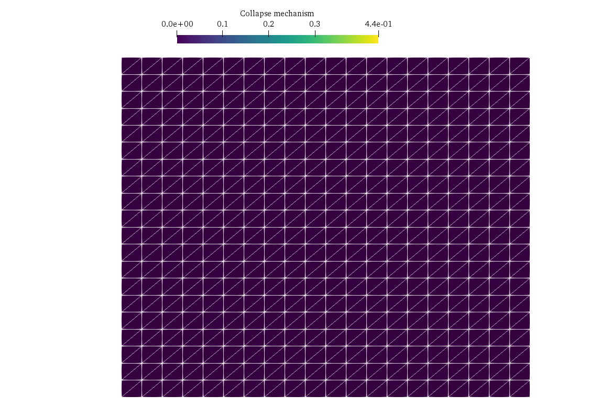

---
jupytext:
  formats: md:myst,ipynb
  text_representation:
    extension: .md
    format_name: myst
    format_version: 0.13
    jupytext_version: 1.16.1
kernelspec:
  display_name: Python 3
  language: python
  name: python3
---

# Three-dimensional limit analysis problem using Semi-Definite Programming

In this demo, we consider a classical limit analysis problem, namely a slope stability problem for a cohesive-frictional material described by a Mohr-Coulomb criterion. The geometry being three-dimensional in this example, the corresponding problem will be a Semi-Definite Programming (SDP) problem. We show how to formulate such constraints using the `dolfinx_optim` package.

In the following, we will denote by $\mathbb{S}_n$ the set of symmetric $n\times n$ matrices.

## Problem formulation

We consider a soil domain $\Omega = [0;L]\times [0;W] \times [0;H]$ with homogeneous Dirichlet boundary conditions $\boldsymbol{u}=0$ on the right $x=L$ and bottom $z=0$. The remaining boundaries have homogeneous Neumann boundary conditions. The loading consists of a gravitational body force $\boldsymbol{f}=(0,0,-\gamma)$ with $\gamma$ being  the soil self-weight. The soil obeys a Mohr-Coulomb criterion of cohesion $c$ and internal friction angle $\phi$, i.e. the stress state $\boldsymbol{\sigma}\in \mathbb{S}_3$ must satisfy $\boldsymbol{\sigma}\in G$ where:

\begin{equation}
G=\left\{\boldsymbol{\sigma}\in \mathbb{S}_3 \text{ s.t. } \sigma_M - a\sigma_m \leq \dfrac{2c\cos\phi}{1+\sin\phi}\right\}
\end{equation}

where $a=\dfrac{1-\sin\phi}{1+\sin\phi}$, $\sigma_M = \max_{I} \{\sigma_I\}$ and $\sigma_m = \min_I \{\sigma_I\}$ with $\sigma_I$ being the eigenvalues of $\boldsymbol{\sigma}$.

The limit analysis problem amounts to finding the slope stability factor given by $SF=\lambda^+\dfrac{\gamma H}{c}$ where $\lambda^+$ is obtained from solving:

\begin{equation}
\begin{array}{rl} 
\displaystyle{\lambda^+ = \inf_{\boldsymbol{u}}} & \displaystyle{\int_\Omega \pi(\nabla^s \boldsymbol{u}) \,\text{d}\Omega}\\
\text{s.t.} & \displaystyle{\int_{\Omega} \boldsymbol{f}\cdot\boldsymbol{u} \,\text{d}\Omega = 1}
\end{array}
\end{equation}

in which $\nabla^s \boldsymbol{u} = \frac{1}{2}(\nabla \boldsymbol{u} + \nabla \boldsymbol{u}^T)$ is the symmetric gradient and $\pi$ is the support function of the convex set $G$:

\begin{align*}
\pi(\boldsymbol{d}) &= \sup_{\boldsymbol{\sigma}\in G} \{\boldsymbol{\sigma}:\boldsymbol{d}\}\\
&= \begin{cases}
c \cot\phi \operatorname{tr}(\boldsymbol{d}) & \text{if } \displaystyle{\operatorname{tr}(\boldsymbol{d}) \geq \sin\phi\left(\sum_I |d_I|\right)} \\
+\infty & \text{otherwise}
\end{cases}
\end{align*}

## Conic reformulation

Following {cite:p}`martin2008finite`, the above support function can be expressed equivalently in a conic-representable fashion using two auxiliary SDP variables $\boldsymbol{Y}_1,\boldsymbol{Y}_2$ as follows:

\begin{equation}
\begin{array}{rl} 
\displaystyle{\pi(\boldsymbol{d}) = \inf_{\boldsymbol{Y}_1,\boldsymbol{Y}_2\in \mathbb{S}_3}} & \dfrac{2c\cos\phi}{1+\sin\phi}\operatorname{tr}(\boldsymbol{Y}_1)\\
\text{s.t.} & \boldsymbol{d} = \boldsymbol{Y}_1 - \boldsymbol{Y}_2\\
& a\operatorname{tr}(\boldsymbol{Y}_1)=\operatorname{tr}(\boldsymbol{Y}_2)\\
& \boldsymbol{Y}_1 \succeq 0, \boldsymbol{Y}_2\succeq 0
\end{array}
\end{equation}

## Implementation

We first important relevant packages and define the box mesh.

```{code-cell} ipython3
from mpi4py import MPI
import numpy as np
import ufl
from dolfinx import mesh, fem, io
from dolfinx_optim.mosek_io import MosekProblem
from dolfinx_optim.convex_function import ConvexTerm
from dolfinx_optim.cones import SDP
from dolfinx_optim.utils import to_vect

L, W, H = (1.2, 2.0, 1.0)
Nx, Ny, Nz = (20, 1, 20)
domain = mesh.create_box(MPI.COMM_WORLD, [(0, 0, 0), (L, W, H)], [Nx, Ny, Nz])
```

Note that we used on purpose only 1 element in the $y$-direction with quite a large width in order to reproduce a 2D plane-strain situation for which we have a good approximation of the exact solution and limit the computation time of this demo.

We then define the conic representation of the Mohr-Coulomb support function:

```{code-cell} ipython3
c = fem.Constant(domain, 1.0)
phi = fem.Constant(domain, np.pi / 6.0)


class MohrCoulomb(ConvexTerm):
    """SDP implementation of Mohr-Coulomb criterion."""

    def conic_repr(self, X):
        Y1 = self.add_var((3,3), cone=SDP(3))
        Y2 = self.add_var((3,3), cone=SDP(3))
        a = (1 - ufl.sin(phi)) / (1 + ufl.sin(phi))
        self.add_eq_constraint(X - to_vect(Y1) + to_vect(Y2))
        self.add_eq_constraint(ufl.tr(Y2) - a * ufl.tr(Y1))
        self.add_linear_term(2 * c * ufl.cos(phi) / (1 + ufl.sin(phi)) * ufl.tr(Y1))
```

In the above, symmetric $n\times n$ matrix variables are created. The SDP constraint is enforced through the cone `SDP(3)`. Note that equality constraints expect scalar or vectors so that we use the `to_vect` utility function to reshape the matrix variables to a vector form.

We can now set up the loading, function spaces and boundary conditions:

```{code-cell} ipython3
gamma = 10.0
f = fem.Constant(domain,(0, 0, -gamma))

def border(x):
    return np.isclose(x[0], L) | np.isclose(x[2], 0)


gdim = 3
V = fem.functionspace(domain, ("CG", 2, (gdim,)))
bc_dofs = fem.locate_dofs_geometrical(V, border)
bcs = [fem.dirichletbc(np.zeros((gdim,)), bc_dofs, V)]
```


We now initiate the `MosekProblem` object and first add the linear equality constraint:

```{code-cell} ipython3
prob = MosekProblem(domain, "3D limit analysis")
u = prob.add_var(V, bc=bcs, name="Collapse mechanism")


prob.add_eq_constraint(ufl.dot(f,u)*ufl.dx, b=1.0)
```

We now add the convex term corresponding to the support function. 
% FIXME: We select a `vertex` integration scheme ensuring an upper bound status of the computed stability factor (see {cite:p}`makrodimopoulos2007upper`).

```{code-cell} ipython3
crit = MohrCoulomb(ufl.sym(ufl.grad(u)), 2)
prob.add_convex_term(crit)
```

The problem can then be solved and results are exported to Paraview.

```{code-cell} ipython3
:tags: [hide-output]
pobj, dobj = prob.optimize()

with io.VTKFile(MPI.COMM_WORLD, "results.pvd", "w") as vtk:
    vtk.write_function(u)
```

We can then check the solution compared with the exact solution provided by {cite:p}`chen2013limit`.

```{code-cell} ipython3
print("2D factor [Chen] (for phi=30°):", 6.69)
print("Computed factor:", pobj*float(gamma*H/c))
```




## References

```{bibliography}
:filter: docname in docnames
```
